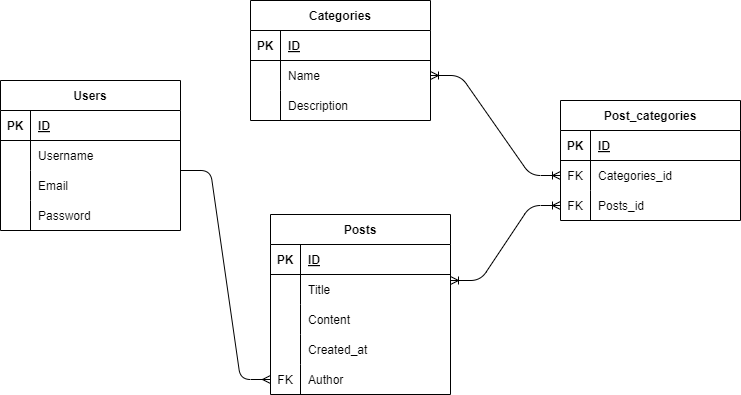

# Blog API REST

## Descripción

La **API REST del Blog** está diseñada para gestionar usuarios, categorías y publicaciones, permitiendo a los usuarios autenticados interactuar con el contenido a través de endpoints bien definidos. Ofrece funcionalidades para la creación, lectura, actualización y eliminación (CRUD) de entradas de blog, junto con una capa de autenticación basada en tokens JWT y permisos personalizados.

## Características

- **Gestión de Usuarios**: Autenticación personalizada y creación de cuentas de usuario.
- **Gestión de Categorías**: Crear, leer, actualizar y eliminar categorías, con una relación de muchos a muchos con las publicaciones.
- **Gestión de Publicaciones**: Crear, leer, actualizar y eliminar publicaciones con validación de datos.
- **Relaciones**:
  - **Usuarios y Publicaciones**: Relación de uno a muchos (un usuario puede tener varias publicaciones).
  - **Publicaciones y Categorías**: Relación de muchos a muchos (una publicación puede tener varias categorías).
- **Serialización**:
  - **Serializar instancias de modelo** y deserializar datos JSON para operaciones CRUD.
  - **Validaciones personalizadas** utilizando `ModelSerializer` para garantizar la integridad de los datos.
- **Autenticación**:
  - **Custom User Model** para la autenticación de usuarios.
  - **Token Authentication** para usuarios autenticados.
  - **JWT Authentication** utilizando `Simple JWT`.
- **Permisos**:
  - **Permission Class** para restringir el acceso a usuarios autenticados.
  - **Custom Permission Class** para establecer reglas de acceso basadas en roles.
- **Filtrado** y **Paginación** para facilitar la navegación y búsqueda de publicaciones.
- **Unit Testing** para asegurar el correcto funcionamiento de la API.
- **Documentación con Swagger** para una fácil integración y pruebas de los endpoints.

## Instalación

Sigue los pasos a continuación para instalar y configurar el proyecto en tu entorno local:

1. **Clona el repositorio**:

   ```bash
   git clone https://github.com/TuUsuario/blog-api-rest.git
   ```

2. **Navega al directorio del proyecto**:

   ```bash
   cd blog-api-rest
   ```

3. **Crea y activa un entorno virtual**:

   ```bash
   python -m venv env
   source env/bin/activate  # En Windows: env\Scripts\activate
   ```

4. **Instala las dependencias**:

   ```bash
   pip install -r requirements.txt
   ```

5. **Configura las variables de entorno** copiando el archivo de ejemplo `.env.example` a `.env` y ajustando las configuraciones necesarias:

   ```bash
   cp .env.example .env
   ```

6. **Configura la base de datos** en el archivo `.env` según tus credenciales locales.

7. **Ejecuta las migraciones** para preparar la base de datos:

   ```bash
   python manage.py migrate
   ```

8. **Crea un superusuario** para acceder al panel de administración:

   ```bash
   python manage.py createsuperuser
   ```

9. **Inicia el servidor**:

   ```bash
   python manage.py runserver
   ```

   El servidor estará disponible en `http://localhost:8000`.

## Documentación de la API

La documentación interactiva de la API generada con **Swagger** está disponible en:

- **Swagger UI**: [http://localhost:8000/swagger/](http://localhost:8000/swagger/)
- **Redoc**: [http://localhost:8000/redoc/](http://localhost:8000/redoc/)

Aquí encontrarás todos los detalles sobre los endpoints disponibles, los parámetros requeridos y las respuestas esperadas.

## Modelo de la Base de Datos

El modelo de la base de datos sigue estas relaciones clave:

- **User (uno a muchos)**: Un usuario puede crear muchas publicaciones.
- **Post (muchos a muchos)**: Un post puede estar asociado con múltiples categorías.



## Pruebas Unitarias

Las pruebas unitarias están diseñadas para garantizar el correcto funcionamiento de los endpoints de la API. Para ejecutarlas, utiliza el siguiente comando:

```bash
python manage.py test
```

## Licencia

Este proyecto está licenciado bajo la Licencia [MIT](URL_DE_LICENCIA).

## Contacto

Para más información, puedes ponerte en contacto con [bmancilla119@gmail.com](mailto:tu_email@ejemplo.com).
